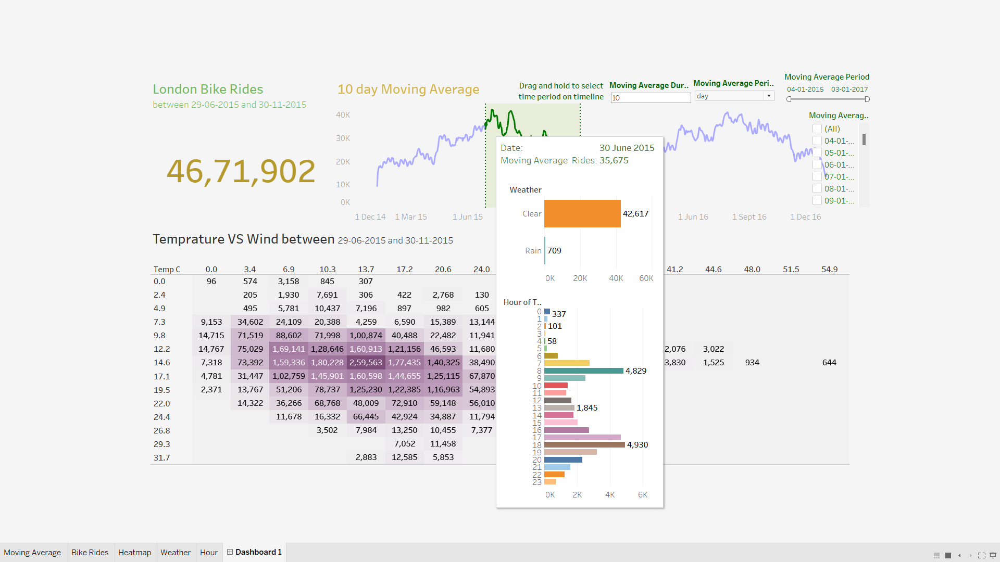
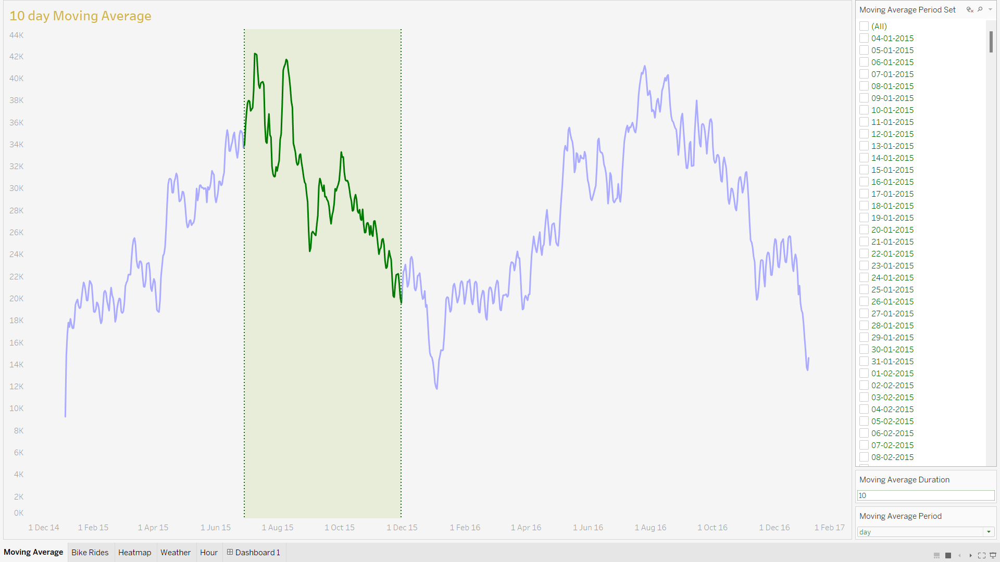
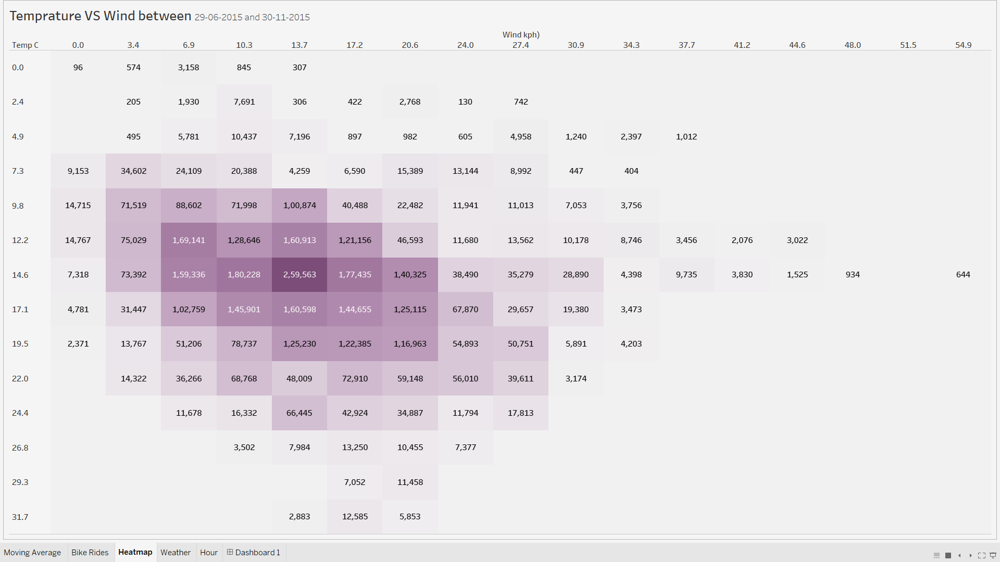
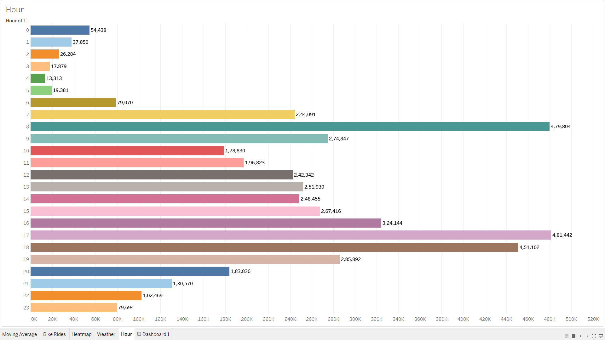

# London Bike Rides
## Tableau Visualization

💽 **Kaggle Dataset** - [London bike sharing dataset
](https://www.kaggle.com/datasets/hmavrodiev/london-bike-sharing-dataset)

>
> ## **Metadata:**
> * "timestamp" - timestamp field for grouping the data
> *  "cnt" - the count of a new bike shares
> *  "t1" - real temperature in C
> * "t2" - temperature in C "feels like"
> * "hum" - humidity in percentage
> * "wind_speed" - wind speed in km/h
> * "weather_code" - category of the weather
> * "is_holiday" - boolean field - 1 holiday / 0 non holiday
> * "is_weekend" - boolean field - 1 if the day is weekend
> * "season" - category field meteorological seasons: 
> * * 0-spring ; 1-summer; 2-fall; 3-winter.
>> "weathe_code" category description:
>> * 1 = Clear ; mostly clear but have some values with haze/fog/patches of fog/ fog in vicinity 
>> * 2 = scattered clouds / few clouds 
>> * 3 = Broken clouds 
>> * 4 = Cloudy 
>> * 7 = Rain/ light Rain shower/ Light rain 
>> * 10 = rain with thunderstorm 
>> * 26 = snowfall 
>> * 94 = Freezing Fog

---

### **Final dashboard**

Average of bike rides in an interval - Line chart visualization 

Heatmap visualization of selected bike ride

Weather bar plot visualization

Hour of time 

---

This visulization is made using Tableau. I tried some visualization and tools to create new features using formule and functions.